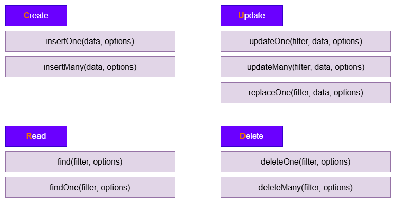
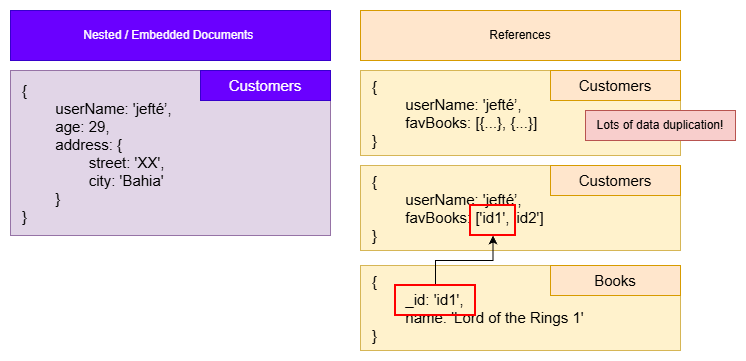
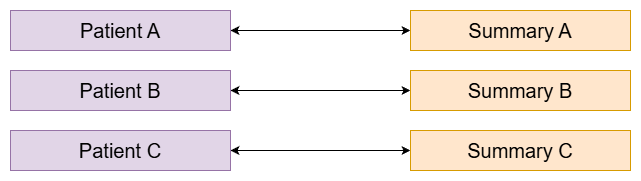
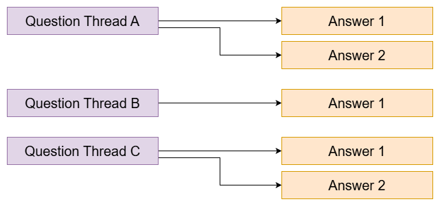
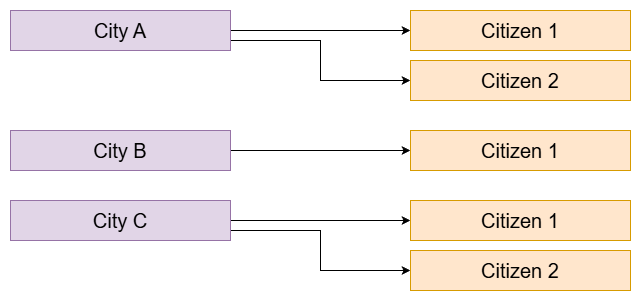
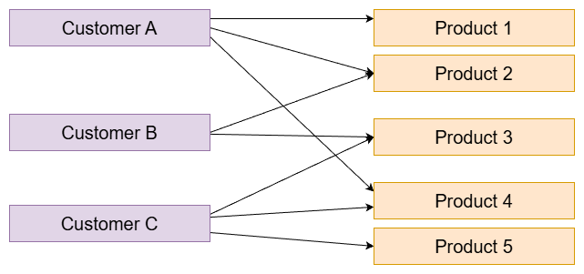
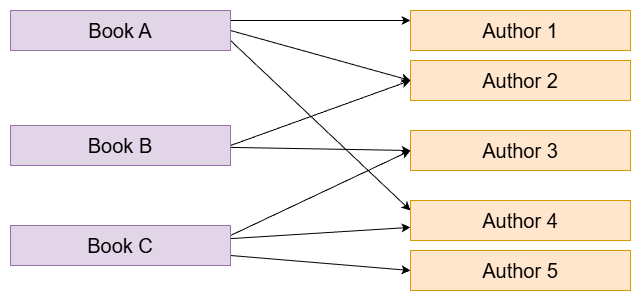

# Resumo: NoSQL e MongoDB

Anotações das aulas. Vou ir atualizando conforme a disciplina anda.

---

## 1. O que é NoSQL?

O **NoSQL** (Not Only SQL) é um paradigma de banco de dados que engloba diversos tipos de bancos de dados não relacionais [1]. Ele foi projetado para responder a desafios modernos de desenvolvimento, oferecendo três pilares principais [1]:
*   **Flexibilidade:** Modelos de dados flexíveis e sem esquemas rígidos (schemaless).
*   **Escalabilidade:** Facilidade para crescer horizontalmente (distribuindo dados em múltiplos servidores).
*   **Alto Desempenho:** Respostas rápidas e eficientes para grandes volumes de dados.

### Os quatro paradigmas NoSQL

Dependendo de como os dados são organizados e acessados, as soluções NoSQL dividem-se em quatro categorias principais [3]:

| Paradigma | Como Funciona | Principais Exemplos |
| :--- | :--- | :--- |
| **Documentos** | Armazena dados como documentos (semelhantes a JSON/BSON) [3]. | **MongoDB**, CouchDB [3] |
| **Chave-Valor** | Associa uma chave única a um valor específico (muito rápido) [3]. | **Redis**, DynamoDB [3] |
| **Família de Colunas** | Organiza dados em colunas flexíveis em vez de linhas rígidas [3]. | **Cassandra**, HBase [3] |
| **Grafos** | Focado em relacionamentos (nós e arestas) [3]. | **Neo4j**, Amazon Neptune [3] |

---

## 2. O que é o MongoDB e como ele funciona

O nome **"Mongo"** vem da palavra em inglês **Humongous** (que significa "Gigante") [3]. Isso reflete seu propósito principal: armazenar e gerenciar gigantescos volumes de dados de maneira altamente eficiente [3].

O **MongoDB** é um banco de dados NoSQL de código aberto e orientado a documentos [3].

### Relacional (SQL) vs não relacional (MongoDB)

Ao contrário dos bancos relacionais (como MySQL ou PostgreSQL), que usam tabelas rígidas estruturadas em colunas e linhas, o MongoDB adota uma abordagem muito mais livre [4]:

```
┌───────────────────────────────────────────────────────────────┐
│                    TABELA RELACIONAL (SQL)                    │
│  ID   │      Nome      │    Idade    │        Cidade          │
├───────┼────────────────┼─────────────┼────────────────────────┤
│   1   │     Jefté      │     33      │       Salvador         │
└───────┴────────────────┴─────────────┴────────────────────────┘

                               VS

┌───────────────────────────────────────────────────────────────┐
│                     DOCUMENTO MONGODB (NoSQL)                 │
│  {                                                            │
│    "_id": ObjectId("60c72b2f9b1d8b2bad789102"),               │
│    "nome": "Jefté",                                           │
│    "idade": 33,                                               │
│    "cidade": "Salvador"                                       │
│  }                                                            │
└───────────────────────────────────────────────────────────────┘
```

### Hierarquia de dados no MongoDB

A estrutura organizacional do MongoDB é simples e intuitiva [4, 12]:
1.  **Servidor:** Pode hospedar múltiplos bancos de dados (Databases) [4].
2.  **Banco de Dados (Database):** Agrupa coleções de dados [4].
3.  **Coleção (Collection):** Equivalente às tabelas do SQL, mas sem esquema fixo (schemaless) [4]. Contém os documentos [4].
4.  **Documento (Document):** Equivalente às linhas ou registros do SQL [4, 6]. É onde as informações reais ficam salvas no formato BSON [4, 6].

> Nota: banco e coleção são criados sozinhos na primeira inserção. Não precisa criar na mão antes de usar.

---

## 3. Estrutura dos dados: JSON e BSON

### JSON

No MongoDB, as informações são manipuladas e visualizadas em formato **JSON** (JavaScript Object Notation) [6]. Um documento JSON é delimitado por chaves `{}` e composto por **campos** (fields) ou propriedades [16].

#### Anatomia de um Documento JSON [16]:
*   Cada campo é um par de **Chave (Key)** e **Valor (Value)** separado por dois-pontos `:` [16].
*   Múltiplos campos são separados por vírgulas `,` [16].
*   As chaves são sempre strings (entre aspas), enquanto os valores podem aceitar diversos tipos de dados [16]:

```json
{
  "nome": "Jefté",                // String (Texto)
  "idade": 35,                     // Número (Inteiro/Decimal)
  "ehProfessor": true,             // Booleano (true ou false)
  "hobbies": ["Lego", "Games"],    // Array (Lista de elementos)
  "endereco": {                    // Documento Incorporado (Objeto Aninhado)
    "rua": "San Martim",
    "cidade": "Salvador"
  }
}
```

### BSON (Binary JSON)

Embora escrevamos e visualizemos os dados em JSON, o MongoDB armazena esses registros internamente como **BSON** (Binary JSON) [6]. 
*   O BSON é uma representação binária do JSON [6].
*   Ele é extremamente rápido para busca, leitura e escrita, além de suportar mais tipos de dados nativos (como datas e identificadores exclusivos de ID do MongoDB).

### Documentos incorporados (em vez de JOIN)

Diferente do SQL convencional, onde dividimos informações em várias tabelas diferentes e as unimos usando `JOIN`, o MongoDB prefere manter os dados que pertencem juntos **no mesmo documento** [9].
*   Isso é feito usando **documentos incorporados** (embedded documents), como o campo `endereco` demonstrado no exemplo acima [9].
*   Isso elimina a lentidão e a complexidade de fazer junções de tabelas frequentes [9].

---

## 4. Comandos no console (mongosh)

Para interagir com o MongoDB via prompt/terminal, utilizamos o shell do MongoDB (`mongosh`) [11]. Abaixo estão os comandos mais comuns do dia a dia [11]:

| Comando | Descrição |
| :--- | :--- |
| `mongosh` | Inicia o terminal interativo do MongoDB [11]. |
| `show databases` ou `show dbs` | Lista todos os bancos de dados ativos no servidor [11]. |
| `use <nome_do_banco>` | Cria ou alterna para o banco de dados especificado (ex: `use shop`) [11]. |
| `show collections` | Exibe as coleções existentes dentro do banco atual [11]. |
| `db.createCollection(" ")` | Cria explicitamente uma nova coleção (opcional) [11]. |
| `db.<coleção>.insertOne({ ... })` | Insere um único documento em uma coleção [11]. |
| `db.<coleção>.find()` | Lista todos os documentos de uma coleção [11]. |

---

## 5. Operações CRUD no MongoDB

O termo **CRUD** representa as quatro operações essenciais de persistência de dados em qualquer sistema [12]:

### Create (inserção)
Insere novos registros (documentos) nas suas coleções [11, 12]:
*   **`insertOne(data, options)`**: Insere **um único** documento [11].
    ```javascript
    db.users.insertOne({ name: "Jefté", age: 35 })
    ```
*   **`insertMany(data, options)`**: Insere **múltiplos** documentos simultaneamente de forma rápida utilizando uma lista (array) de objetos.
    ```javascript
    db.users.insertMany([
      { name: "Brenno", age: 10 },
      { name: "Maria", age: 28 }
    ])
    ```

### Read (leitura)
Encontra documentos salvos no seu banco de dados:
*   **`find(filter, options)`**: Busca **todos** os documentos que correspondem aos critérios de filtro. Se deixado vazio `find()`, retorna tudo [11].
    ```javascript
    db.users.find({ age: 35 })
    ```
*   **`findOne(filter, options)`**: Retorna apenas **o primeiro** documento que corresponde ao filtro.
    ```javascript
    db.users.findOne({ name: "Jefté" })
    ```

### Update (atualização)
Modifica documentos existentes:
*   **`updateOne(filter, data, options)`**: Atualiza apenas **um único** documento correspondente ao filtro.
    ```javascript
    db.users.updateOne({ name: "Jefté" }, { $set: { age: 36 } })
    ```
*   **`updateMany(filter, data, options)`**: Modifica **todos** os documentos que baterem com as condições do filtro.
    ```javascript
    db.users.updateMany({ age: { $lt: 18 } }, { $set: { menorDeIdade: true } })
    ```
*   **`replaceOne(filter, data, options)`**: Substitui **todo o documento** correspondente por um novo objeto (com exceção do campo imutável `_id`).
    ```javascript
    db.users.replaceOne({ name: "Brenno" }, { name: "Brenno", age: 11, status: "ativo" })
    ```

### Delete (remoção)
Exclui registros da coleção:
*   **`deleteOne(filter, options)`**: Deleta **apenas o primeiro** documento que corresponder aos filtros especificados.
    ```javascript
    db.users.deleteOne({ name: "Maria" })
    ```
*   **`deleteMany(filter, options)`**: Exclui **todos** os documentos que atendem às condições do filtro.
    ```javascript
    db.users.deleteMany({ status: "inativo" })
    ```

---

Lembrar: o MongoDB é schemaless. Na mesma coleção um documento pode ter campos que o outro não tem. Isso não quebra o banco.

---

## 6. Prática no mongosh — loja_informatica

Comandos da aula. O slide do CRUD:



- Create: `insertOne(data, options)`, `insertMany(data, options)`
- Read: `find(filter, options)`, `findOne(filter, options)`
- Update: `updateOne(filter, data, options)`, `updateMany(filter, data, options)`, `replaceOne(filter, data, options)`
- Delete: `deleteOne(filter, options)`, `deleteMany(filter, options)`

`filter` escolhe o documento. `data` é o que entra ou o que muda. `options` é opcional.

### Exibir os bancos de dados

```javascript
show databases
```

### Criar / entrar no banco

```javascript
use loja_informatica
```

O `use` troca o banco atual. Se o nome ainda não existir, ele fica “pendurado” até a primeira escrita.

### Criar nova collection

```javascript
db.createCollection("cliente")
```

### Mostrar todas as collections

```javascript
show collections
```

### Mostrar todos os documentos

```javascript
db.cliente.find()
```

(No começo a coleção está vazia. Depois dos inserts, esse comando lista tudo.)

### Inserir 1 document

```javascript
db.cliente.insertOne({
  "nome": "jefté",
  "idade": 35,
  "pets": ["dora", "sabrina"],
  "endereco": {
    "logradouro": "Sossego"
  }
})
```

Tem array (`pets`) e objeto dentro do objeto (`endereco`).

### Inserir vários documents de uma vez

```javascript
db.cliente.insertMany([
  { "nome": "Brenno" },
  { "nome": "João" },
  { "nome": "Maria" },
  { "nome": "José" },
  { "nome": "Noé" }
])
```

Aqui os docs só têm `nome`. Como é schemaless, pode.

### Buscar pelo campo

```javascript
db.cliente.find({ "nome": "José" })
```

### Buscar pelo identificador único

```javascript
db.cliente.find({
  _id: ObjectId("6a7bbab007ff2cf8649f68a9")
})
```

Esse `_id` é exemplo. O meu vai ser outro — copiar o que o `insertOne` ou o `find()` devolver.

`show databases` não mostra banco vazio. Se eu só dei `use` e ainda não inseri nada, o nome pode não aparecer. Normal.

---

## 7. Relacionamentos no MongoDB (1:1, 1:N, N:M)

Aula 3 — modelagem e schemas. No SQL a gente liga tabelas com FK e JOIN. No MongoDB a decisão é outra: **embarcar** (embedded) ou **referenciar** (references com `ObjectId`).



| Abordagem | Ideia | Quando faz sentido |
| :--- | :--- | :--- |
| **Embedded** (documento incorporado) | O dado relacionado fica **dentro** do documento principal | Dados que pertencem juntos, lidos juntos, sem compartilhar muito |
| **References** (`ObjectId`) | Coleções separadas; um doc guarda o `_id` do outro | Dados com vida própria, compartilhados, ou que podem crescer sem limite |

### Perguntas antes de modelar

O slide manda pensar nisso antes de sair criando coleção:

1. **Quais dados são necessários?** — campos e como se relacionam  
2. **Onde o dado é consumido?** — define as coleções / agrupamentos  
3. **Qual o tipo de exibição?** — quais consultas vão ser mais comuns  
4. **Qual a frequência de leitura/escrita?** — otimiza busca rápida ou gravação sem duplicar

### Leitura pesada vs escrita pesada

| Cenário | Objetivo | Prioriza |
| :--- | :--- | :--- |
| **Muitas consultas (read-heavy)** | Dado já no formato que o frontend usa | **Embedded** — menos JOIN / `$lookup` em tempo de execução |
| **Muitas gravações (write-heavy)** | Evitar duplicação e atualizar em um lugar só | **References** — um `_id` em comum, atualiza um doc |

Exemplos do slide: catálogo / home → embedded. Pedidos financeiros / logs → referência.

---

### One-to-one (1:1) — um para um

Um paciente ↔ um resumo. Uma pessoa ↔ um carro “principal”. Cada lado liga só a um do outro.



#### Embarcado

Paciente + resumo de doenças no **mesmo** documento. Os dados pertencem ao paciente e são lidos juntos.

```javascript
db.patients.insertOne({
  name: "Jefté",
  age: 35,
  diseaseSummary: {
    diseases: ["cold", "broken leg"]
  }
})
```

`diseaseSummary` é um documento dentro do documento. Sem segunda coleção, sem join.

#### Por referência

Pessoa e carro em coleções **separadas**. O carro guarda o `_id` do dono. Cada um tem vida própria na aplicação.

```javascript
db.persons.insertOne({
  name: "Jefté",
  age: 35,
  salary: 3000
})

db.cars.insertOne({
  model: "BMW",
  price: 40000,
  owner: ObjectId("6aa9e2cee9c288ce1241317e")
})
```

> O `ObjectId(...)` do `owner` tem que ser o `_id` real da pessoa. Depois do `insertOne` em `persons`, copiar o `insertedId` e colar no carro.

---

### One-to-many (1:N) — um para muitos

Um tópico tem várias respostas. Uma cidade tem vários cidadãos.





#### Embarcado

Respostas dentro do próprio tópico. Bom quando o “muitos” é um array que não explode de tamanho.

```javascript
db.questionThreads.insertOne({
  creator: "Jefté",
  question: "How does that work?",
  answers: [
    { text: "Like that." },
    { text: "Thanks!" }
  ]
})
```

Um documento, várias respostas no array `answers`.

#### Por referência

Cidade numa coleção; cidadãos em outra, cada um com `cityId`. Evita estourar o limite de **16MB** por documento se forem milhões de cidadãos.

```javascript
db.cities.insertOne({
  name: "New York City",
  coordinates: { lat: 21, lng: 55 }
})

db.citizens.insertMany([
  { name: "Jefté Goes", cityId: ObjectId("5b98d6b44d01c52e1637a99f") },
  { name: "Brenno Salvador", cityId: ObjectId("5b98d6b44d01c52e1637a99f") }
])
```

Os dois cidadãos apontam para o **mesmo** `_id` da cidade → 1 cidade, N cidadãos.

---

### Many-to-many (N:M) — muitos para muitos

Cliente ↔ vários produtos. Livro ↔ vários autores (e o autor em vários livros).





#### Embarcado

Pedidos “congelados” dentro do cliente. O histórico daquele momento fica no documento (título, preço, quantidade).

```javascript
db.customers.insertOne({
  name: "Jefté",
  age: 35
})

db.customers.updateOne(
  {},
  {
    $set: {
      orders: [
        { title: "A Book", price: 12.99, quantity: 2 }
      ]
    }
  }
)
```

`updateOne({}, ...)` pega o **primeiro** documento da coleção (filtro vazio). Em aula serve; no dia a dia eu filtraria por `name` ou `_id`.

#### Por referência

Autores e livros em coleções separadas. O livro guarda um **array de ObjectIds** dos autores — relacionamento cruzado sem duplicar o autor inteiro em cada livro.

```javascript
db.authors.insertMany([
  { name: "Jorge Amado", age: 78, address: { street: "Bahia" } },
  { name: "Graciliano Ramos", age: 55, address: { street: "Rio de Janeiro" } }
])

db.books.updateOne(
  {},
  {
    $set: {
      authors: [
        ObjectId("5b98d9e44d01c52e1637a9a6"),
        ObjectId("5b98d9e44d01c52e1637a9a7")
      ]
    }
  }
)
```

Cada `ObjectId` no array `authors` é o `_id` de um autor. Um livro → vários autores; um autor pode aparecer em vários livros.

---

### Comparativo rápido: Embedded vs References

| Característica | Documentos incorporados | Referências (`ObjectId`) |
| :--- | :--- | :--- |
| **Organização** | Tudo no mesmo documento | Dados em coleções distintas |
| **Caso de uso** | Dados que pertencem juntos, sem se sobrepor | Dados compartilhados ou com vida própria |
| **Desempenho** | Leitura ótima (uma consulta, sem join) | Escrita sem duplicar; atualiza em um lugar |
| **Limitações** | Limite de **16MB** por documento | Precisa de consulta extra ou `$lookup` |

### Regra prática (do slide)

*   **Use Embedded** quando: dados acessados juntos, forte pertencimento, pouco compartilhamento, tamanho do doc sob controle.  
*   **Use References** quando: dados compartilhados, vida independente, crescimento sem teto fixo, ou N:M mais complexo.  
*   **Ajuste fino:** olhar o uso real do sistema — equilíbrio leitura vs escrita.

Lembrar: não existe “sempre embutir” nem “sempre referenciar”. O modelo segue a pergunta da aplicação.
